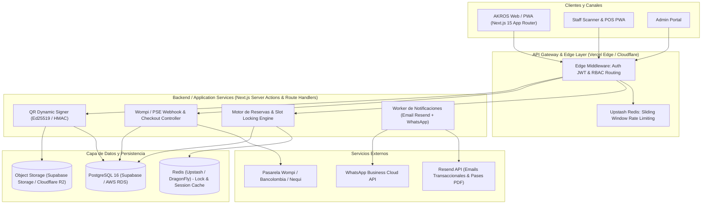
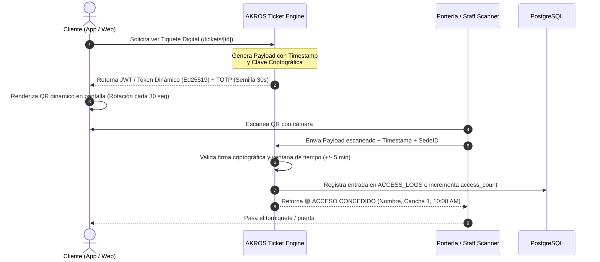
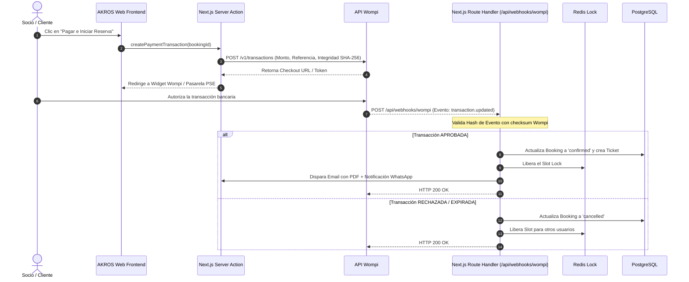
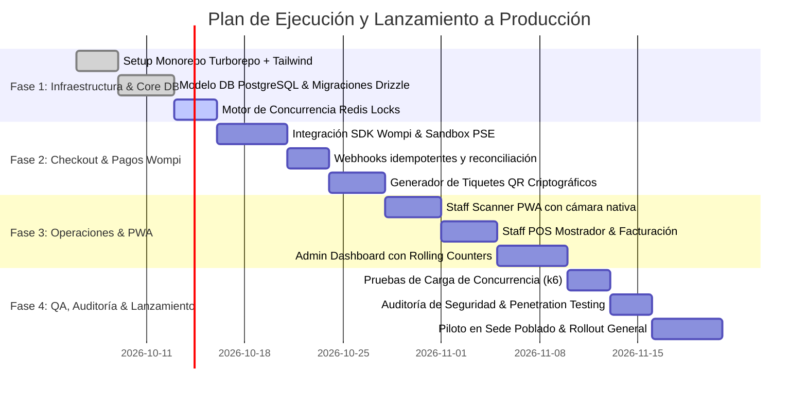

# AKROS Club · System Design & Production Architecture Document
> **Version:** 2.0.0-PROD  
> **Brand Identity:** AKROS Athletic & Wellness Club (Medellín, Colombia)  
> **Target Release:** Q1/Q2 Production Rollout  
> **Primary Technology Stack:** Next.js 15 (App Router, Server Actions), React 19, TypeScript 5, Tailwind CSS, Turborepo, PostgreSQL (Supabase/Neon), Redis (Upstash), Wompi API / PSE, Resend, Ed25519 QR Gate System.

---

## 1. Visión Ejecutiva del Producto

**AKROS Club** es la plataforma digital de gestión deportiva y bienestar de alto nivel diseñada para operar complejos atléticos multisede (actualmente *Sede Poblado* y *Sede Laureles* en Medellín, Colombia). 

El sistema digitaliza íntegramente la experiencia del club a través de cuatro frentes unificados:
1. **Experiencia del Cliente (Web / PWA):** Catálogo interactivo de instalaciones de alto rendimiento (Tenis en polvo de ladrillo, Pádel indoor panorámico, Natación semiolímpica, Gimnasio funcional y Wellness/Zona húmeda), reserva horaria con bloqueo anti-colisión en tiempo real, pasarela de pagos colombiana integrada (PSE, Tarjetas, Nequi, Bancolombia QR) y emisión de pases digitales con QR criptográfico antifraude.
2. **Operación de Campo y Puerta (Staff Scanner PWA):** Validación biométrica/QR instantánea de accesos en portería mediante escáner con cámara nativa o pistola láser, con validación offline tolerante a fallas de red.
3. **Punto de Venta de Recepción (Staff POS):** Facturación rápida en mostrador para walk-ins, asignación manual de canchas y cobro presencial en efectivo/datáfono.
4. **Gobierno Corporativo y Analítica (Admin Portal):** Panel de control gerencial con visualización de ingresos, índice de ocupación por hora/sede, control de catálogo físico, gestión de personal (RBAC), auditoría financiera y motor de promociones.

### 1.1 Referencias de Diseño e Inspiración Sensorial
* **The Grind (`thegrind.nl`):** Pantalla de bienvenida cinematográfica con desvanecimiento tipográfico, transiciones fluidas de entrada y estética deportiva editorial.
* **Waverun Media (`waverunmedia.com`):** Revelado progresivo con efecto "stagger" en cuadrículas de tarjetas, microinteracciones magnéticas y feedback háptico/visual.
* **Alpine Guides (`alpineguides.co.nz`):** Contadores métricos rodantes ("rolling counters") en tiempo real para paneles analíticos y jerarquía limpia de servicios.
* **Lacoste Ace Breaker:** Simulación y visualización de líneas de cancha, badges técnicos y dinamismo visual en el agendamiento deportivo.

---

## 2. Arquitectura General del Sistema

El ecosistema está concebido bajo una arquitectura **Monorepo Modular con Turborepo**, garantizando el aislamiento de capas de negocio, tipado estricto extremo a extremo (End-to-End Type Safety) y máxima reutilización de código entre aplicaciones web y móviles.



### 2.1 Estructura del Monorepo (Turborepo)
```
akros-sportcomplex/
├── apps/
│   ├── web/                     # Aplicación Next.js 15 (Customer, Staff & Admin)
│   │   ├── src/
│   │   │   ├── app/             # Rutas por Route Groups: (public), (auth), (customer), (staff), (admin)
│   │   │   ├── components/      # Componentes UI organizados por dominio
│   │   │   ├── hooks/           # Custom React hooks (audio, geolocation, media queries)
│   │   │   └── lib/             # Clientes de servicios (db, redis, wompi, resend)
│   │   └── tailwind.config.ts   # Configuración de Tailwind CSS con Design Tokens
├── packages/
│   ├── core/                    # Reglas de negocio puras, tipos TypeScript y validadores Zod
│   │   └── src/
│   │       ├── domain/          # Entidades (Booking, Court, User, Ticket)
│   │       ├── schemas/         # Validaciones Zod de entrada/salida
│   │       └── utils/           # Formateadores monetarios (COP), fechas y slots
│   ├── ui/                      # Biblioteca de componentes atómicos Tailwind + Radix
│   ├── db/                      # Esquema Prisma / Drizzle ORM, migraciones y seeders
│   ├── auth/                    # Configuración NextAuth / Supabase Auth y RBAC guards
│   ├── config/                  # ESLint, Prettier y TsConfig compartidos
│   └── email-templates/         # Plantillas React-Email para confirmación y recordatorios
├── turbo.json                   # Pipeline de compilación y orquestación de tareas
└── package.json
```

---

## 3. Modelo de Datos y Esquema de Base de Datos (PostgreSQL)

El esquema relacional garantiza consistencia estricta ACID, integridad referencial y soporte para bloqueos atómicos de concurrencia.

```mermaid
erDiagram
    VENUES ||--o{ COURTS : contains
    COURTS ||--o{ COURT_SCHEDULES : defines
    COURTS ||--o{ BOOKINGS : reserved_for
    USERS ||--o{ BOOKINGS : makes
    USERS ||--o{ MEMBERSHIPS : holds
    BOOKINGS ||--|| PAYMENTS : settled_by
    BOOKINGS ||--|| TICKETS : generates
    TICKETS ||--o{ ACCESS_LOGS : verified_in
    USERS ||--o{ AUDIT_LOGS : performs

    USERS {
        uuid id PK
        string email UK
        string full_name
        string phone
        string document_id
        enum role "customer | staff | admin"
        string password_hash
        boolean is_active
        timestamp created_at
    }

    VENUES {
        uuid id PK
        string slug UK
        string name
        string address
        string city
        string phone
        jsonb operating_hours
        boolean is_active
    }

    COURTS {
        uuid id PK
        uuid venue_id FK
        string slug UK
        string name
        enum category "canchas | piscinas | gimnasio | bienestar"
        string surface_type
        string lighting_spec
        integer max_attendees
        numeric hourly_rate_cop
        boolean is_indoor
        boolean is_maintenance
        boolean admin_only
        string cover_image_url
        string[] gallery_urls
    }

    BOOKINGS {
        uuid id PK
        string code UK "AKR-YYYYMMDD-XXXX"
        uuid user_id FK
        uuid court_id FK
        date booking_date
        time start_time
        time end_time
        integer attendees_count
        numeric total_amount_cop
        enum status "draft | held | confirmed | cancelled | completed"
        timestamp held_until
        timestamp created_at
    }

    PAYMENTS {
        uuid id PK
        uuid booking_id FK UK
        string wompi_transaction_id UK
        string payment_method_type "PSE | CARD | NEQUI | CASH"
        numeric amount_in_cents
        string currency "COP"
        enum status "PENDING | APPROVED | DECLINED | VOIDED"
        jsonb gateway_response
        timestamp settled_at
    }

    TICKETS {
        uuid id PK
        uuid booking_id FK UK
        string qr_token_hash UK
        string signature
        integer access_count
        integer max_entries
        boolean is_revoked
        timestamp valid_from
        timestamp valid_until
    }

    ACCESS_LOGS {
        uuid id PK
        uuid ticket_id FK
        uuid staff_user_id FK
        uuid venue_id FK
        enum validation_result "ALLOWED | ALREADY_USED | EXPIRED | INVALID"
        timestamp scanned_at
    }
```

### 3.1 DDL en PostgreSQL (Extracto de Producción)
```sql
-- Extensiones requeridas
CREATE EXTENSION IF NOT EXISTS "uuid-ossp";
CREATE EXTENSION IF NOT EXISTS "pgcrypto";

-- Tipos Enumerados
CREATE TYPE user_role AS ENUM ('customer', 'staff', 'admin');
CREATE TYPE facility_category AS ENUM ('canchas', 'piscinas', 'gimnasio', 'bienestar');
CREATE TYPE booking_status AS ENUM ('held', 'confirmed', 'cancelled', 'completed');
CREATE TYPE payment_gateway_status AS ENUM ('PENDING', 'APPROVED', 'DECLINED', 'VOIDED');

-- Tabla de Usuarios
CREATE TABLE users (
    id UUID PRIMARY KEY DEFAULT uuid_generate_v4(),
    email VARCHAR(255) NOT NULL UNIQUE,
    full_name VARCHAR(150) NOT NULL,
    phone VARCHAR(30) NOT NULL,
    document_id VARCHAR(50) NOT NULL,
    role user_role NOT NULL DEFAULT 'customer',
    password_hash VARCHAR(255),
    is_active BOOLEAN NOT NULL DEFAULT TRUE,
    created_at TIMESTAMPTZ NOT NULL DEFAULT NOW(),
    updated_at TIMESTAMPTZ NOT NULL DEFAULT NOW()
);

-- Tabla de Espacios e Instalaciones
CREATE TABLE courts (
    id UUID PRIMARY KEY DEFAULT uuid_generate_v4(),
    venue_id UUID NOT NULL REFERENCES venues(id) ON DELETE RESTRICT,
    slug VARCHAR(100) NOT NULL UNIQUE,
    name VARCHAR(120) NOT NULL,
    category facility_category NOT NULL,
    surface_type VARCHAR(80) NOT NULL,
    lighting_spec VARCHAR(100) NOT NULL,
    max_attendees SMALLINT NOT NULL DEFAULT 4,
    hourly_rate_cop NUMERIC(12, 2) NOT NULL,
    is_indoor BOOLEAN NOT NULL DEFAULT FALSE,
    is_maintenance BOOLEAN NOT NULL DEFAULT FALSE,
    admin_only BOOLEAN NOT NULL DEFAULT FALSE,
    cover_image_url TEXT NOT NULL,
    metadata JSONB DEFAULT '{}'::jsonb,
    created_at TIMESTAMPTZ NOT NULL DEFAULT NOW()
);

-- Tabla de Reservas
CREATE TABLE bookings (
    id UUID PRIMARY KEY DEFAULT uuid_generate_v4(),
    code VARCHAR(32) NOT NULL UNIQUE,
    user_id UUID NOT NULL REFERENCES users(id) ON DELETE RESTRICT,
    court_id UUID NOT NULL REFERENCES courts(id) ON DELETE RESTRICT,
    booking_date DATE NOT NULL,
    start_time TIME NOT NULL,
    end_time TIME NOT NULL,
    attendees_count SMALLINT NOT NULL DEFAULT 1,
    total_amount_cop NUMERIC(12, 2) NOT NULL,
    status booking_status NOT NULL DEFAULT 'held',
    held_until TIMESTAMPTZ,
    created_at TIMESTAMPTZ NOT NULL DEFAULT NOW(),
    updated_at TIMESTAMPTZ NOT NULL DEFAULT NOW(),
    -- Restricción para evitar colisiones lógicas
    CONSTRAINT chk_time_window CHECK (end_time > start_time)
);

-- Índice único parcial para evitar dobles reservas activas en la misma cancha y horario
CREATE UNIQUE INDEX idx_unique_active_court_slot 
ON bookings (court_id, booking_date, start_time) 
WHERE (status IN ('held', 'confirmed'));
```

---

## 4. Algoritmo de Concurrencia y Bloqueo Distribuido (Slot Locking)

Uno de los problemas más críticos en complejos deportivos con alta demanda es el **Overbooking** (dos usuarios seleccionando la misma cancha a las 7:00 p. m. al mismo tiempo).

### 4.1 Estrategia Híbrida: Redis + PostgreSQL Advisory Locks
1. **Paso 1: Adquisición de Bloqueo Temporal en Redis (10 Minutos)**
   Cuando el cliente hace clic en un horario y entra al flujo de Checkout, el frontend solicita un bloqueo provisional:
   ```typescript
   // Clave en Redis: lock:court:{courtId}:{date}:{time}
   const lockKey = `lock:court:${courtId}:${date}:${time}`;
   const acquired = await redis.set(lockKey, userId, {
     nx: true,      // Solo si no existe
     ex: 600        // Expira en 600 segundos (10 min)
   });

   if (!acquired) {
     throw new SlotAlreadyReservedException("Este horario acaba de ser tomado por otro socio.");
   }
   ```
2. **Paso 2: Registro en Base de Datos con Estado `HELD`**
   Se crea un registro preliminar en la tabla `bookings` con `status = 'held'` y `held_until = NOW() + INTERVAL '10 minutes'`.
3. **Paso 3: Liberación Automática (TTL / Cron)**
   Si el webhook de Wompi no aprueba el pago dentro de los 10 minutos, Redis expira la clave automáticamente y un worker o trigger marca el registro como `cancelled`.
4. **Paso 4: Confirmación Transaccional**
   Al recibir el webhook de pago exitoso de Wompi:
   ```sql
   BEGIN;
   SELECT * FROM bookings 
   WHERE id = $1 AND status = 'held' 
   FOR UPDATE;

   UPDATE bookings 
   SET status = 'confirmed', held_until = NULL, updated_at = NOW() 
   WHERE id = $1;

   INSERT INTO tickets (booking_id, qr_token_hash, signature, valid_from, valid_until)
   VALUES ($1, $2, $3, $4, $5);

   COMMIT;
   ```

---

## 5. Protocolo de Tiquetes QR Criptográficos y Control de Acceso

Para evitar que los usuarios compartan capturas de pantalla estáticas por WhatsApp y permitir acceso no autorizado:



### 5.1 Estructura del Token QR
```json
{
  "bId": "b472e391-49b8-4c8d-8e6f-402a94432170",
  "code": "AKR-20261005-7821",
  "uid": "u912384",
  "cId": "tenis-cancha-1",
  "date": "2026-10-05",
  "slot": "10:00",
  "vId": "poblado",
  "exp": 1791216000,
  "sig": "MEQCIGs...ED25519_SIGNATURE"
}
```

---

## 6. Sistema de Diseño & Tokens Visuales (Tailwind CSS)

Para la implementación real en producción, todo el estilo se estandariza bajo **Tailwind CSS v3 / v4**, garantizando fidelidad milimétrica a la identidad de **AKROS Club** y accesibilidad WCAG 2.2 AA.

### 6.1 Paleta de Color Corporativa
```typescript
// tailwind.config.ts
export default {
  darkMode: ['class', '.dark'],
  theme: {
    extend: {
      colors: {
        brand: {
          dark: '#111815',         // Fondo oscuro principal de alto contraste
          surface: '#17221d',      // Superficie oscura elevada
          surfaceSoft: '#202d26',  // Bordes y contenedores secundarios
          emerald: '#123e30',      // Verde esmeralda insignia
          emeraldLight: '#1d6048', // Verde interactivo / botones hover
          accent: '#c9ef75',       // Lima cinético (acento de alto impacto)
          limeSoft: '#edf5dc',     // Pistacho suave para chips y fondos de iconos
          pistachio: '#dcebc9',    // Tono complementario suave
        },
        neutral: {
          50: '#fafbf9',           // Canvas modo claro
          100: '#f2f5f1',          // Superficie clara base
          200: '#e4eae1',          // Bordes y divisores modo claro
          500: '#738379',          // Texto secundario / subtítulos
          900: '#141d18',          // Texto principal en modo claro
        },
      },
      fontFamily: {
        sans: ['Plus Jakarta Sans', 'system-ui', 'sans-serif'],
        display: ['Plus Jakarta Sans', 'sans-serif'],
        mono: ['JetBrains Mono', 'monospace'],
      },
      borderRadius: {
        '2xl': '16px',
        '3xl': '24px',
        'pill': '9999px',
      },
      backdropBlur: {
        glass: '16px',
      },
      boxShadow: {
        'glass-light': '0 8px 32px 0 rgba(18, 62, 48, 0.08)',
        'glass-dark': '0 8px 32px 0 rgba(0, 0, 0, 0.45)',
        'accent-glow': '0 0 24px -4px rgba(201, 239, 117, 0.35)',
      },
    },
  },
  plugins: [],
}
```

### 6.2 Especificación del Componente de Hero con Tarjeta Glass (`BookingHero`)
El rediseño validado y aprobado en el mockup incorpora la siguiente arquitectura de clases Tailwind:

```tsx
// apps/web/src/components/booking/booking-hero.tsx
export function BookingHero({ service, category, available }) {
  return (
    <div className="relative w-full h-[300px] md:h-[340px] rounded-3xl overflow-hidden border border-neutral-200/80 dark:border-brand-surfaceSoft shadow-sm">
      {/* Imagen panorámica de alta definición */}
      

      {/* Gradientes cinemáticos para legibilidad */}
      <div className="absolute inset-0 bg-gradient-to-t from-black/75 via-black/20 to-transparent pointer-events-none" />
      <div className="absolute inset-0 bg-gradient-to-b from-black/40 via-transparent to-transparent pointer-events-none" />

      {/* Contenedor Flotante Glassmorphism (Top-Left) */}
      <div className="absolute top-5 left-5 right-5 sm:right-auto sm:max-w-md flex items-center gap-3.5 p-3 sm:p-4 rounded-2xl bg-white/85 dark:bg-[#122b21]/85 backdrop-blur-glass border border-white/60 dark:border-brand-accent/25 shadow-glass-light dark:shadow-glass-dark">
        {/* Icono temático en cápsula pistacho */}
        <div className="w-12 h-12 rounded-xl flex items-center justify-center shrink-0 bg-brand-limeSoft text-brand-emerald dark:bg-[#203a2e] dark:text-brand-accent shadow-inner">
          <category.Icon className="w-6 h-6" />
        </div>

        {/* Tipografía jerárquica */}
        <div className="flex-1 min-w-0">
          <h1 className="text-base sm:text-lg font-bold text-neutral-900 dark:text-white tracking-tight truncate">
            {service.name}
          </h1>
          <p className="text-xs sm:text-sm text-neutral-600 dark:text-neutral-300 font-medium truncate">
            {service.description} · Sede {service.sede}
          </p>
        </div>
      </div>

      {/* Badges Flotantes de Estado (Bottom) */}
      <div className="absolute bottom-5 left-5 right-5 flex items-center justify-between pointer-events-none">
        {/* Estado Operativo con Pulso */}
        <div className="inline-flex items-center gap-2 px-3.5 py-1.5 rounded-full bg-[#122b21]/90 dark:bg-[#0e1a14]/90 backdrop-blur-md border border-brand-accent/40 text-white font-mono text-xs font-bold tracking-wider shadow-md">
          <span className="relative flex h-2 w-2">
            <span className="animate-ping absolute inline-flex h-full w-full rounded-full bg-brand-accent opacity-75" />
            <span className="relative inline-flex rounded-full h-2 w-2 bg-brand-accent" />
          </span>
          {available ? 'DISPONIBLE' : 'OCUPADO'}
        </div>

        {/* Ubicación */}
        <div className="inline-flex items-center gap-1.5 px-3 py-1.5 rounded-full bg-black/60 backdrop-blur-md border border-white/15 text-white/90 text-xs font-medium">
          <MapPin className="w-3.5 h-3.5 text-brand-accent" />
          Sede {service.sede}
        </div>
      </div>
    </div>
  );
}
```

### 6.3 Sistema de Iconografía Corporativa (`lucide-react`) & Mapeo Semántico

La identidad visual de **AKROS Club** utiliza exclusivamente el conjunto vectorial de **Lucide React** (`lucide-react`), seleccionado por su geometría neutral, alta legibilidad en pantallas retina y compatibilidad total con Server Components y tree-shaking en Next.js 15.

#### 1. Escala de Tamaños y Grosores (Stroke Width)
* **Microiconos en badges y chips (12px – 14px):** `strokeWidth={2}` (máxima definición visual en badges como `ShieldCheck`, `LiveDot`, `Star`).
* **Iconos en línea / UI general (15px – 18px):** `strokeWidth={1.75}` (equilibrio óptico con la tipografía *Plus Jakarta Sans* en botones, links y selectores).
* **Iconos en cápsulas destacadas / `IconBox` (20px – 24px):** `strokeWidth={1.5}` dentro de contenedores redondeados de 44px o 48px con tono semántico pistacho (`bg-brand-limeSoft`).
* **Iconos de gran formato / Modales (32px – 48px):** `strokeWidth={1.25}` para evitar pesadez visual.

#### 2. Inventario y Mapeo por Dominios del Club

| Dominio / Módulo | Icono Lucide | Nombre del Glifo | Uso Específico en la Plataforma |
| :--- | :--- | :--- | :--- |
| **Canchas & Deportes** | 👟 | `Footprints` | Icono principal de canchas (tenis, pádel, fútbol), simbolizando la pisada técnica. |
| | 🏆 | `Trophy` | Torneos, torneos abiertos de pádel/tenis y eventos competitivos del club. |
| | ⚡ | `Activity` | Métricas de rendimiento, frecuencia cardíaca e intensidad deportiva. |
| | 🎾 | `Layers` | Tipo de superficie (Polvo de ladrillo, resina acrílica, grama sintética). |
| | 💡 | `Lightbulb` | Iluminación oficial (LED 500 Lux antideslumbramiento para juego nocturno). |
| **Acuática & Piscinas** | 🌊 | `Waves` | Icono insignia de natación, piscina olímpica y nado libre. |
| | 🧭 | `Compass` | Especificaciones de carril (50m x 25m, profundidad, carriles rápidos). |
| **Fuerza & Fitness** | 🏋️ | `Dumbbell` | Icono de gimnasio, musculación y zona de peso libre. |
| | 🔥 | `Flame` | Entrenamiento de alta intensidad (HIIT), acondicionamiento y quema calórica. |
| | ⚡ | `Zap` | Potencia funcional, cross-training y clases express. |
| **Wellness & Bienestar** | ✨ | `Sparkles` | Icono insignia de bienestar, spa, masajes de descarga y relajación. |
| | ☀️ | `SunMedium` | Sauna seco, baño turco, termas y zonas de hidroterapia. |
| | ☕ | `Coffee` / `Utensils` | Lounge social, cafetería saludable y nutrición deportiva. |
| **Reserva & Logística** | 📅 | `CalendarDays` / `CalendarCheck` | Selector interactivo de fechas y visualización de días disponibles. |
| | 🕒 | `Clock3` / `Clock` | Franjas horarias (slots de 60 min) y horarios de apertura. |
| | 📍 | `MapPin` | Identificador de sede (*Sede Poblado* / *Sede Laureles*). |
| | 👥 | `Users` | Contador de asistentes según aforo máximo del espacio. |
| **Checkout & Pagos** | 💳 | `CreditCard` | Pasarela de tarjetas y cobro con Wompi / datáfono. |
| | 🧾 | `Receipt` | Resumen detallado de la orden y facturación electrónica DIAN. |
| | 🛡️ | `ShieldCheck` | Indicador de reserva segura, pago encriptado y póliza médica deportiva. |
| | ✅ | `CheckCircle2` / `BadgeCheck` | Transacción aprobada, cuenta verificada y testimonios auditados. |
| **Control de Acceso / Portería**| 📱 | `QrCode` / `ScanLine` | Generación y escaneo de pases digitales dinámicos antifraude. |
| | 📸 | `Camera` | Activación de cámara del dispositivo en la PWA de empleados. |
| | 🔦 | `Flashlight` | Disparo de linterna para validación en porterías con baja luz nocturna. |
| | 🎟️ | `Ticket` | Visualizador de entradas adquiridas y tiquetes activos. |
| **Navegación & Sistema** | ➡️ | `ArrowRight` / `ArrowLeft` | CTAs de conversión, avances de checkout y migas de pan. |
| | ☰ | `Menu` / `X` | Apertura y cierre de menú móvil táctil y modales. |
| | ☀️ / 🌙 | `Sun` / `Moon` | Conmutador dinámico de tema claro/oscuro con persistencia local. |
| | 🚪 | `LogOut` | Cierre de sesión seguro en el perfil del usuario. |
| **Backoffice / Admin** | ✏️ | `Pencil` | Edición de espacios, tarifas y datos de empleados. |
| | ➕ / 🗑️ | `Plus` / `Trash2` | Creación y eliminación de registros en catálogo y membresías. |
| | 👁️ | `Eye` | Inspección de auditoría de reservas y bitácora de accesos. |

#### 3. Reglas de Accesibilidad y Buenas Prácticas
1. **Iconos Decorativos (`aria-hidden="true"`):** Todo icono que acompañe un texto explicativo (ej. `<MapPin /> Sede Poblado`) debe ser marcado como decorativo para evitar lecturas redundantes en lectores de pantalla.
2. **Iconos Accionables Sin Texto Visible:** Los botones interactivos compuestos únicamente por un icono (ej. botón de cambio de tema, botón de cerrar modal, botón de escáner) DEBEN incorporar obligatoriamente `aria-label="Descripción de la acción"` o un elemento visualmente oculto accesible `<span className="sr-only">`.
3. **Escalabilidad Vectorial y Cero Distorsión:** Todos los iconos se renderizan en formato SVG puro, heredando el color del texto mediante `currentColor` o clases semánticas de Tailwind (`text-brand-accent`, `text-brand-emerald`), garantizando nitidez perfecta en cualquier escala de pantalla.

---

## 7. Integración de Pasarela de Pagos (Wompi Colombia)

Para el cobro en moneda local (COP) se adopta **Wompi** (Bancolombia) debido a su soporte nativo de:
- Transferencias PSE (con redirección síncrona).
- Débito instantáneo Nequi (Push Notification al celular del socio).
- Tarjetas de Crédito / Débito (Visa, Mastercard, Amex).
- Corresponsal Bancolombia / Botón Bancolombia QR.



---

## 8. Seguridad, Roles (RBAC) y Cumplimiento Legal

### 8.1 Matriz de Control de Acceso Basado en Roles (RBAC)
| Recurso / Ruta | Público (Anónimo) | Cliente (`customer`) | Empleado (`staff`) | Administrador (`admin`) |
| :--- | :---: | :---: | :---: | :---: |
| Landing Page (`/`) | Lectura | Lectura | Lectura | Lectura |
| Catálogo de Servicios (`/services`) | Lectura | Lectura | Lectura | Lectura |
| Agendar Reserva (`/services/[cat]/[id]`) | Ver (requiere login al pagar) | Lectura / Escritura | Lectura / Escritura | Lectura / Escritura / Override |
| Checkout & Pago (`/checkout`) | Denegado | Crear / Pagar | Crear / Pagar | Modo Simulación / Auditor |
| Tiquetes Propios (`/tickets`) | Denegado | Lectura | Lectura | Lectura |
| Escáner de Acceso Puerta (`/scanner`) | Denegado | Denegado | Lectura / Validar | Lectura / Validar |
| Punto de Venta POS (`/pos`) | Denegado | Denegado | Operar / Facturar | Operar / Facturar |
| Panel Analítico (`/admin`) | Denegado | Denegado | Denegado | Control Total |
| CRUD Catálogo de Instalaciones | Denegado | Denegado | Denegado | Crear, Editar, Eliminar |
| Modificación de Tarifas y Sedes | Denegado | Denegado | Denegado | Control Total |

### 8.2 Cumplimiento Normativo Colombiano
1. **Habeas Data (Ley Estatutaria 1581 de 2012):**
   - Checkbox explícito no premarcado en registro y checkout con hipervínculo a la Política de Tratamiento de Datos Personales.
   - Endpoint de autoservicio para revocatoria del consentimiento y derecho al olvido (eliminación o anonimización de cuenta).
2. **Facturación Electrónica DIAN:**
   - La arquitectura soporta la emisión asíncrona de la factura electrónica mediante proveedor tecnológico autorizado (ej. Siigo, Alegra o Factus) tras la confirmación de la transacción en Wompi.
3. **PCI-DSS:**
   - Ningún dato de tarjeta de crédito (PAN, CVV, fecha de expiración) toca los servidores de AKROS Club. Todo el procesamiento se realiza mediante Wompi Elements / Widget tokenizado.

---

## 9. Plan de Despliegue y Hoja de Ruta hacia Producción



---

## 10. Checklist Técnico Pre-Lanzamiento (Production Readiness)

- [x] **Diseño Visual & Identidad:** Logo oficial AKROS Club (`Akros-logo.png`), paleta esmeralda/lima/mist, tipografía corporativa Plus Jakarta Sans.
- [x] **Hero de Servicios:** Título y atributos unificados dentro del contenedor de cristal flotante de alta jerarquía.
- [x] **Accesibilidad:** Soporte `prefers-reduced-motion: reduce`, contraste WCAG 2.2 AA (4.5:1 texto regular, 3:1 componentes UI), soporte por teclado en modales y grids.
- [ ] **Base de Datos:** Configurar pooler de conexiones (PgBouncer / Supabase Connection Pooler) para soportar picos de concurrencia (>500 conexiones simultáneas).
- [ ] **Idempotencia de Pagos:** Almacenar `transaction_id` único en base de datos para prevenir doble acreditación por reintentos de webhooks.
- [ ] **Generador de Tiquetes Offline:** Clave pública Ed25519 instalada en el escáner PWA para permitir validación de socios aún si la sede sufre una caída temporal de internet.
- [ ] **Observabilidad:** Integración de Sentry para rastreo de excepciones en el cliente y servidor, con alertas automáticas a Slack/Discord del equipo técnico.
